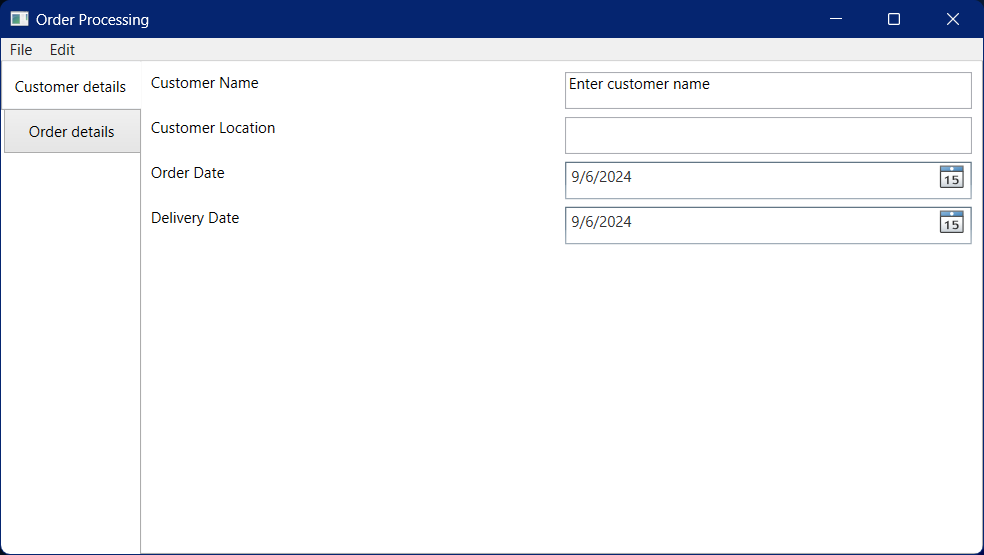
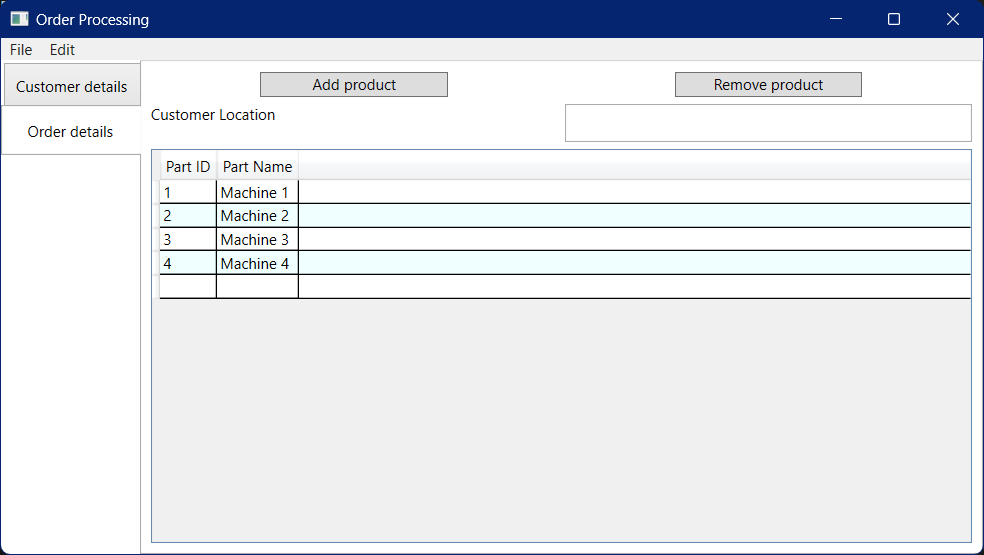
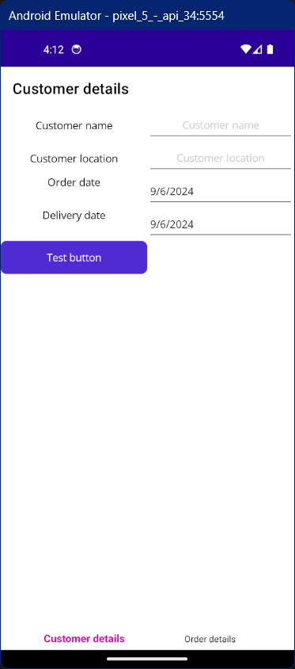
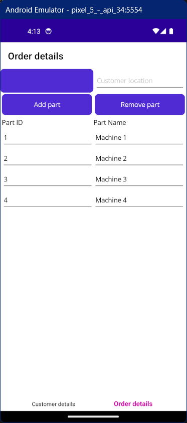

# OrderingProcessingApp

This is demo application to understand various phases of application development and deployments.

## View

There are 3 types of views implemented. WPF view for windows only application. MAUI application is for Android only, intention was for both Windows and Android but Windows application stopped working in between. WinUI application to understand new WinUI functionalities but there are few deployment related issues which are not yet resolved.

## WPF view

This is windows only application created using default WPF controls.

## MAUI view

This is (currently) Android only application. This is using MAUI controls and Community tool kit controls for simple pop up messages. Application will work on windows machine also with some more effort to get it working.

## MVVM architecture

This application is using MVVM architecture where views can be WPF or MAUI depending on start up project. But using common ViewModel and Model made sure that all applications are supporting all requried functionalities.

## Web API

There is Web API for database where all modifications done by application are stored in Database and hence support cross platform functionalities.

## Installer

Using NSIS installer to install WPF Order processing app. With basic required infromtation to be modified during creating new installer.